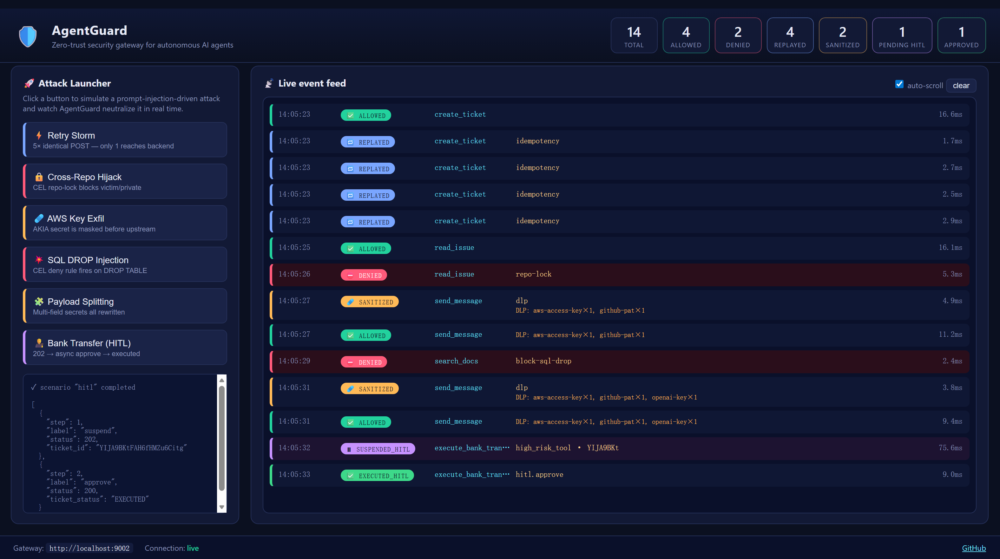

<h1 align="center">🛡️ AgentGuard</h1>

<p align="center"><b>面向自主 AI Agent 的零信任安全网关</b> —— 以 Sidecar 反向代理拦截 LLM 工具调用，用 <em>确定性仲裁</em> 中和 <em>概率性幻觉</em> 与 <em>间接提示词注入</em>。</p>

<p align="center">
  <a href="LICENSE"></a>
  <a href="pyproject.toml"></a>
  <a href="https://fastapi.tiangolo.com/"></a>
  <a href="tests"></a>
  
  
</p>

<p align="center">
  <a href="#-30-秒亲眼看见它工作"><b>30 秒演示</b></a> ·
  <a href="#-为什么需要-agentguard"><b>为什么</b></a> ·
  <a href="#️-三层确定性防御"><b>防御原理</b></a> ·
  <a href="#-demo-场景"><b>Demo 场景</b></a> ·
  <a href="#-快速上手docker-compose"><b>快速上手</b></a> ·
  <a href="#-本地开发不使用-docker"><b>本地开发</b></a> ·
  <a href="#-与其他开源网关的区别"><b>对比</b></a> ·
  <a href="#️-roadmap"><b>Roadmap</b></a>
</p>

> 🌟 **如果这个项目对你有启发，请点一个 Star** — 它让 AI Agent 安全相关的讨论被更多人看到。

---

## ✨ 30 秒亲眼看见它工作

```bash
git clone <repo-url> && cd agentguard
./scripts/demo.sh          # 一键拉起整套栈 + 自动跑 6 个攻防场景
```

然后打开 👉 **<http://localhost:9002>** — 这是 AgentGuard 自带的 **实时防御大盘**：

- 📡 **Live Event Feed**：网关每一次裁决以颜色区分的徽章实时闪现（✅ allowed / ⛔ denied / 🔁 replayed / 🩹 sanitized / ⏸ HITL）。
- 🚀 **Attack Launcher**：6 个一键按钮现场模拟攻击 —— *Retry Storm / Cross-Repo Hijack / AWS Key Exfil / SQL DROP / Payload Splitting / $50k Bank Transfer*，点完即可看到它们如何被中和。
- 📊 **Stats Cards**：按判决类型实时聚合计数，展示"拦了多少、脱敏了多少、挂起了多少"。

```
┌─────────────────────────── AgentGuard Dashboard :9002 ──────────────────────────┐
│  total 37   ✅ 18   ⛔ 6   🔁 5   🩹 4   ⏸ 2   ✅ 2                             │
├─────────────────────────────────────────────────────────────────────────────────┤
│  🚀 Attack Launcher            │  📡 Live event feed                            │
│  ⚡ Retry Storm       ──▶      │  10:22:01 🔁 REPLAYED   create_ticket  cache   │
│  🔒 Cross-Repo Hijack ──▶      │  10:22:03 ⛔ DENIED     read_issue    repo-lock│
│  🩹 AWS Key Exfil     ──▶      │  10:22:05 🩹 SANITIZED  send_message   dlp×3   │
│  💥 SQL DROP          ──▶      │  10:22:07 ⏸ PENDING    bank_transfer  hitl    │
│  🧩 Payload Splitting ──▶      │  10:22:09 ✅ EXECUTED   bank_transfer  approved│
│  🧑‍⚖️ Bank Transfer    ──▶      │  …                                             │
└─────────────────────────────────────────────────────────────────────────────────┘
```

> 💡 把你录制的 10 秒演示 GIF 放到 `docs/demo.gif`，下方即可自动显示：
>
> <!--  -->

---

## 🤔 为什么需要 AgentGuard？

LLM Agent 通过**工具调用（Tool / MCP Calls）** 把自然语言翻译成真实副作用：创建工单、合并 PR、转账、删库。但概率模型注定会犯三类执行层错误：

| 真实世界事故 | 根因 | AgentGuard 对策 |
|---|---|---|
| **Replicate 2024**：LLM 代理在超时后"重试"导致同一笔付款扣 5 次 | 大模型幻觉 + 非幂等写操作 | ⚡ 幂等令牌锁（Redis `SETNX`） |
| **GitHub MCP "toxic flows"**：私有仓 Issue 评论诱导 Agent 跨仓泄露源码 | 间接提示词注入 + 权限过宽 | 🔒 CEL `repo-lock` 会话绑定 |
| **OpenAI Assistants 密钥外泄**：Agent 被诱导把环境变量粘贴到外部 Slack | Agent 无法区分数据/指令 | 🩹 DLP 正则改写 payload |
| **Supabase MCP 删库事件**：自然语言指令误触发 `DROP TABLE` | 高危操作未经人类确认 | ⏸ 异步 HITL + HMAC 签名回调 |

> 📚 这些事故的工程化分析详见项目随附的研究报告 [`面向自主 AI Agent 的零信任安全网关架构.md`](../面向自主%20AI%20Agent%20的零信任安全网关架构：基于%20Sidecar%20模式防范非幂等重试与提示词注入的研究报告.md)。
>
> AgentGuard 的核心假设是 **"不信任 Agent"**：即便 LLM 被完全劫持，副作用执行仍必须穿过网关的确定性仲裁层。

---

## 🛡️ 三层确定性防御

```
                            ┌─────────────────── AgentGuard Sidecar :8080 ──────────────────┐
                            │                                                                │
  AI Agent ─ HTTP ──▶       │  [1] Idempotency ─▶ [2] CEL Policy ─▶ [3] Payload Sanitizer    │ ─▶ Backend :9000
  (LangChain / AutoGen /    │        │                                        │               │
   Claude / MCP client)     │      Redis                                      ▼               │
                            │                                        [4] HITL Interceptor     │
                            │                                                 │               │
                            │      Event Bus ───────────────────► SSE /agentguard/events      │
                            │         │                                       │               │
                            │         ▼                                       ▼               │
                            │   ring buffer + /stats                    PostgreSQL            │
                            └─────────┼───────────────────────────────────────┼───────────────┘
                                      │                                       │
                                Dashboard :9002                     Approval Console :9001
                             (live feed + launcher)                (HMAC-signed callback)
```

### 1️⃣ 幂等性令牌锁 — 打破幻觉重试风暴

基于 `session + tool_name + intent_hash` 派生 HMAC 密钥，用 Redis `SETNX` 原子锁保证"**同一个操作只会被执行一次**"。重试请求在网关处直接命中缓存回放，Agent 的死循环被打破，后端**永远**不会被重复调用。

```bash
# Agent 以为超时，连发 5 次完全相同的 POST
for i in {1..5}; do
  curl -s -X POST localhost:8080/tools/create_ticket \
    -H 'Idempotency-Key: demo-42' \
    -H 'X-Session-Id: sess-a' \
    -d '{"tool":{"name":"create_ticket"},"arguments":{"title":"hotfix"}}'
done

# 后端调用次数：1（不是 5）—— 剩下 4 次都是 AgentGuard 回放的 cached 200
curl -s localhost:9000/stats
# {"invocations":{"create_ticket":1}}
```

### 2️⃣ CEL 策略 + Payload 清洗 — 对抗提示词注入

- **CEL (Common Expression Language)** 在 µs 级评估 `jwt`、`session`、`mcp.tool.name`、`request.body` 等上下文，实现**声明式** allow/deny 与结构断言。例：
  ```yaml
  - name: repo-lock
    when:  'has(session.initial_repository) && has(request.body.repository)'
    allow: 'request.body.repository == session.initial_repository'
  ```
- **DLP 正则**对 `AKIA`、`ghp_`、`sk-`、JWT、PEM 私钥等**自动脱敏改写**（而非拒绝），即便 Agent 被劫持，真实凭证也不会离开网关。
  ```
  原始:  "Rotating key AKIA0123456789ABCDEF — please notify ops"
  改写:  "Rotating key AKIA****REDACTED — please notify ops"
         ↑ 后端看到的内容
  ```

### 3️⃣ 异步 HITL 拦截 — 高危操作必须人工共签

命中 `high_risk_tools` 白名单的调用立即返回 `202 Accepted + ticket_id`，请求上下文持久化到 PostgreSQL。审批人通过 HMAC-SHA256 签名的 `/approve` 回调（模拟 OAuth 2.0 CIBA）放行后，网关才会真正执行原请求。

```bash
# 1. Agent 发起高危调用
curl -X POST localhost:8080/tools/execute_bank_transfer -d '{"amount":50000}'
# → 202 Accepted  {"ticket_id":"tx-abc","status":"PENDING_APPROVAL","poll_url":"..."}

# 2. CFO 在审批台点"Approve"（本质：服务端生成 HMAC 签名 POST /hitl/approve）
# 3. 网关重放原请求，后端首次被调用，ticket 状态 → EXECUTED
```

---

## 🎬 Demo 场景

| # | 场景（模拟的攻击者目标） | 触发脚本 | AgentGuard 判决 |
|---|---|---|---|
| 1 | 大模型幻觉引发的 5× 非幂等重试 | `demo_retry_storm.py` | 🔁 4× REPLAYED，后端只被调 1 次 |
| 2 | 跨仓库 prompt injection 读私有源码 | `demo_injection.py` | ⛔ DENIED by `repo-lock` |
| 3 | `DROP TABLE users;` 注入到搜索工具 | `demo_sql_drop.py` | ⛔ DENIED by `block-sql-drop` |
| 4 | AWS / GitHub / OpenAI 凭证外泄到 Slack | `demo_dlp.py` | 🩹 SANITIZED，三个 secret 全部改写 |
| 5 | 分字段切片规避 DLP 的高级注入 | `demo_payload_splitting.py` | 🩹 SANITIZED，递归全字段 |
| 6 | $50k 银行转账高危工具 | `demo_hitl.py` | ⏸ PENDING → ✅ EXECUTED 需人类签字 |

**单独运行场景**（需先 `docker compose up -d`）：

```bash
pip install "agentguard[demos] @ ."           # 或手动装 rich + httpx
python examples/demo_agent/demo_retry_storm.py
python examples/demo_agent/demo_injection.py
python examples/demo_agent/demo_sql_drop.py
python examples/demo_agent/demo_dlp.py
python examples/demo_agent/demo_payload_splitting.py
python examples/demo_agent/demo_hitl.py       # AUTO_APPROVE=1（默认）时自动签名通过
```

**一键跑完全部 6 个**：

```bash
./scripts/demo.sh      # 栈未启动时用这个，会先 docker compose up
./scripts/try.sh       # 栈已启动时使用
```

---

## 🚀 快速上手（Docker Compose）

```bash
git clone <repo-url> && cd agentguard
cp .env.example .env

docker compose up --build -d          # gateway / redis / postgres / backend / approval-console / dashboard
docker compose logs -f agentguard     # 观察网关日志
```

> 🇨🇳 **国内用户如遇 `i/o timeout` / `dial tcp ...:443` 拉镜像超时**：Docker Hub 在中国大陆已不可直连，老镜像源（dockerproxy / mirror.baidubce / docker.m.daocloud 等）从 2024 年陆续停服。请按照 [`docs/docker-mirror.md`](docs/docker-mirror.md) 配置当前可用的镜像加速器（1ms.run / xuanyuan / 1panel 等），或用代理预拉 `redis:7-alpine` `postgres:16-alpine` `python:3.11-slim` 后重跑。

| 端口 | 服务 | 作用 |
|-----|------|------|
| **9002** | **Dashboard** | **实时大盘 + 一键攻击发射台** ← 从这里开始玩 |
| 8080 | AgentGuard Gateway | 你把 Agent 的 baseURL 指向这里 |
| 9001 | Approval Console | 模拟审批台（人工点 Approve） |
| 9000 | Mock Backend | 假 MCP 工具服务（带调用计数 `/stats`） |
| 6379 | Redis | 幂等锁 + 缓存 |
| 5432 | PostgreSQL | HITL 工单注册表 |

### 把你自己的 Agent 指过来

```python
# LangChain 伪代码
from langchain_openai import ChatOpenAI
from langchain.agents import create_react_agent

tools = load_mcp_tools(base_url="http://localhost:8080")   # ← AgentGuard
agent = create_react_agent(ChatOpenAI(), tools)
```

Agent 不需要任何改动 —— AgentGuard 是透明反向代理，响应 body 与 upstream 完全一致，只会在必要时返回 `202 / 403 / 回放缓存`。

---

## 💻 本地开发（不使用 Docker）

```bash
python -m venv .venv && source .venv/bin/activate
pip install --no-deps cel-python==0.4.0 pendulum lark tomli jmespath python-dateutil
pip install -e ".[dev,demos]"
pytest -q                              # 23 个测试全部通过
uvicorn agentguard.main:app --reload   # 启动网关
```

> ⚠️ `cel-python` 从 0.5.0 开始引入了 `google-re2` 的 C 扩展依赖。为避免该 native 编译环节，仓库固定 `cel-python==0.4.0`；Dockerfile 与 CI 已处理。

### 配置速查

所有配置通过环境变量或 `.env` 文件传入（见 [`.env.example`](.env.example)）：

| 变量 | 默认值 | 说明 |
|-----|--------|-----|
| `AGENTGUARD_UPSTREAM_URL` | `http://mock-backend:9000` | 真实后端 / MCP 服务器地址 |
| `AGENTGUARD_REDIS_URL` | `redis://redis:6379/0` | 幂等锁存储 |
| `AGENTGUARD_POSTGRES_DSN` | `postgresql+asyncpg://…` | HITL 工单注册表 |
| `AGENTGUARD_POLICIES_PATH` | `/app/configs/policies.yaml` | CEL 规则文件 |
| `AGENTGUARD_DLP_RULES_PATH` | `/app/configs/dlp_rules.yaml` | DLP 正则文件 |
| `AGENTGUARD_HITL_HMAC_SECRET` | — | 审批回调签名密钥（生产请改） |
| `AGENTGUARD_IDEMPOTENCY_TTL` | `3600` | 幂等缓存 TTL（秒） |

---

## 📁 仓库结构

<details>
<summary>展开完整树</summary>

```
agentguard/
├── configs/
│   ├── policies.yaml               # CEL allow/deny 规则 + 高危工具清单
│   └── dlp_rules.yaml              # 敏感信息脱敏正则
├── src/agentguard/
│   ├── main.py                     # FastAPI 入口 + lifespan
│   ├── settings.py                 # pydantic-settings
│   ├── proxy.py                    # 反向代理 + 中间件链
│   ├── models.py                   # RequestContext / TicketStatus
│   ├── events.py                   # ⚡ 事件总线（ring buffer + asyncio 订阅）
│   ├── events_api.py               # ⚡ /agentguard/events SSE + /stats
│   ├── middleware/
│   │   ├── idempotency.py          # defense #1 — 幂等令牌锁
│   │   ├── cel_policy.py           # defense #2a — CEL 策略
│   │   ├── payload_sanitizer.py    # defense #2b — DLP 改写
│   │   └── hitl.py                 # defense #3 — 异步 HITL
│   ├── cel/engine.py               # celpy 封装
│   ├── storage/
│   │   ├── redis_store.py
│   │   └── hitl_registry.py        # SQLAlchemy async
│   └── hitl/
│       ├── webhook.py
│       └── approval_api.py         # /approve /reject /status /pending
├── examples/
│   ├── mock_backend/server.py      # 假 MCP 工具服务（带 /stats 调用计数）
│   ├── mock_approval_console/      # 审批台 Web UI
│   ├── dashboard/                  # ✨ 实时大盘 + 攻击发射台（端口 9002）
│   │   ├── server.py               # FastAPI 后端 + SSE 代理 + /api/scenario
│   │   └── static/                 # index.html / styles.css / app.js
│   └── demo_agent/                 # 6 个 rich 彩色演示脚本
├── scripts/
│   ├── demo.sh                     # 一键起栈 + 跑完 6 个场景
│   └── try.sh                      # 栈已启动时只跑 6 个场景
├── tests/                          # 23 个 pytest 单测 + 端到端
├── docs/                           # architecture.md / quickstart.md
├── docker-compose.yml / Dockerfile
└── .env.example
```

</details>

---

## 📑 研究报告 → 代码模块对照

| 研究报告章节 | 实现位置 |
|---|---|
| 核心痛点一：大模型幻觉与非幂等重试 | `middleware/idempotency.py` |
| 网关级防御一：密码学令牌 + 状态机 | `middleware/idempotency.py` + `storage/redis_store.py`（SETNX + TTL） |
| 核心痛点二：间接提示词注入与数据窃取 | `middleware/cel_policy.py` + `middleware/payload_sanitizer.py` 联防 |
| 网关级防御二：CEL + WASM Payload 清洗 | `cel/engine.py` + `configs/dlp_rules.yaml`（WASM 在 MVP 用 Python 正则等价） |
| 网关级防御三：异步 HITL 拦截 | `middleware/hitl.py` + `hitl/approval_api.py` + PostgreSQL 请求注册表 |
| 业界前沿架构（Docker MCP Gateway / OpenClaw PRISM / Agentgateway） | `proxy.py` catch-all Sidecar 路由 ≈ "智能拦截器"模式 |
| 可观测性与实时大盘 | `events.py` + `events_api.py` + `examples/dashboard/` |

---

## ⚔️ 与其他开源网关的区别

| 特性 | AgentGuard | [Agentgateway](https://github.com/agentgateway/agentgateway) | Docker MCP Gateway | 传统 API Gateway (Kong/Envoy) |
|------|:----------:|:------------:|:------------------:|:-----------------------------:|
| 幂等重试防御 | ✅ HMAC 派生 + Redis SETNX | ❌ | ❌ | ⚠️ 需自行实现 |
| CEL 策略引擎 | ✅ 声明式 YAML | ⚠️ 自定义 DSL | ❌ | ⚠️ 需自写插件 |
| Payload 级 DLP 改写 | ✅ 递归全字段 | ⚠️ 仅 body pass-through | ❌ | ❌ |
| 异步 HITL + HMAC 回调 | ✅ PostgreSQL 持久化 | ❌ | ❌ | ❌ |
| 实时事件大盘（SSE） | ✅ 内置 9002 面板 | ❌ | ❌ | 需外接 Grafana |
| 语言/栈 | Python + FastAPI（易 fork） | Rust | Go | Lua/Go |
| 适用场景 | AI Agent / MCP / LangChain | 通用 API 网关 | MCP CLI 工具 | 传统微服务 |

> AgentGuard 的核心定位：**不是更快的网关，而是更懂 AI Agent 的网关**。三层防御都为了对抗 LLM 特有的"概率性故障模式"而设计。

---

## 🧪 测试

```bash
pytest -q                              # 23 passed
```

覆盖：

- `test_idempotency.py` — 重复请求缓存回放、TTL 过期、派生键、处理中 409
- `test_cel_policy.py` — ci-bot 工具白名单、repo-lock、deny 规则、高危工具枚举
- `test_payload_sanitizer.py` — AWS/GitHub/OpenAI 密钥脱敏、多规则并用、干净载荷放行
- `test_hitl_flow.py` — 202 挂起、/pending、HMAC 批准/拒绝、执行回包
- `test_events_bus.py` — 事件总线 allowed/denied/sanitized/suspended 发布 + `/stats` 聚合
- `test_e2e_demos.py` — demo 场景的端到端验证

---

## 🗺️ Roadmap

**v0.1 (current MVP)** ✅ 本仓库
- [x] 幂等令牌锁 + CEL 策略 + DLP + 异步 HITL
- [x] 实时事件总线 + 可视化大盘
- [x] 6 个攻防 demo 场景 + 一键运行脚本
- [x] Docker Compose 一键起栈

**v0.2 (next)**
- [ ] **Envoy + WASM 插件版本**：把 DLP/CEL 中间件编译为 WASM 以接入生产级数据面
- [ ] **多租户 RBAC**：用 Casbin / OPA 扩展 CEL 引擎
- [ ] **MCP stdio 模式**：同时支持 MCP over stdio（非仅 HTTP）
- [ ] **回合级上下文追踪**：`X-Agent-Step-Id` header 串联多次调用

**v0.3 (research)**
- [ ] **eBPF 内核级观测**：对接 AgentSight 实现进程/syscall 级旁路审计
- [ ] **LLM prompt 签名**：基于远程证明（Remote Attestation）证明"这条 prompt 确实来自可信 Agent"
- [ ] **自适应策略学习**：从历史 allowed 流量自动收紧 CEL 规则

---

## 🤝 Contributing

欢迎任意形式的贡献：

1. **Bug / 想法** → 开 [Issue](../../issues)
2. **代码** → Fork → 新分支 → `pytest -q && ruff check` → PR
3. **攻击场景扩展** → 在 `examples/demo_agent/` 新增 `demo_*.py`，并在 `configs/policies.yaml` 补齐对应规则 & 在 `examples/dashboard/server.py` 的 `SCENARIOS` 加一个按钮
4. **文档 / 翻译** → `docs/` 目录，英文版欢迎

提交前请确保：`pytest -q` 通过、`ruff check src examples tests` 无错误。

---

## 💡 设计说明

- **MVP 范围**：本仓库专注研究报告中**三大网关级防御**。eBPF / LD_PRELOAD 内核级观测作为未来扩展。
- **WASM 等价实现**：报告中以 Rust WASM 动态修改 HTTP Body；MVP 用 Python 中间件 + 正则 DLP 等价落地，接口设计保留演进空间。
- **HITL 回调**：使用 HMAC-SHA256 签名的 `/approve` 接口模拟 OAuth 2.0 CIBA；生产部署建议对接 Keycloak 或其他 OIDC 平台，并追加 MFA 与数字签名校验。
- **故障策略**：Redis / PostgreSQL / CEL 失败均 **fail-closed**（返回 5xx / 403），杜绝绕过。

---

## 📜 许可证

[Apache License 2.0](LICENSE) —— 随意用于商业项目，记得保留版权声明。

## 🙏 致谢

架构设计受到以下前沿工作的启发：

- [Agentgateway](https://github.com/agentgateway/agentgateway) —— Rust-native 通用 Agent 网关
- [Docker MCP Gateway](https://github.com/docker/mcp-gateway) —— MCP 协议的 CLI 网关
- OpenClaw PRISM —— 基于策略的 Agent 运行时防御
- AgentSight —— eBPF 级别 Agent 观测
- [`cel-python`](https://github.com/cloud-custodian/cel-python) —— Google CEL 的 Python 实现
- FastAPI / SQLAlchemy / Redis / PostgreSQL / Rich —— 站在巨人的肩膀上

---

<p align="center"><i>Built with ☕ to make autonomous AI agents safe to deploy in production.</i></p>
<p align="center"><b>If AgentGuard helps you — please drop a ⭐ — it really does help.</b></p>
