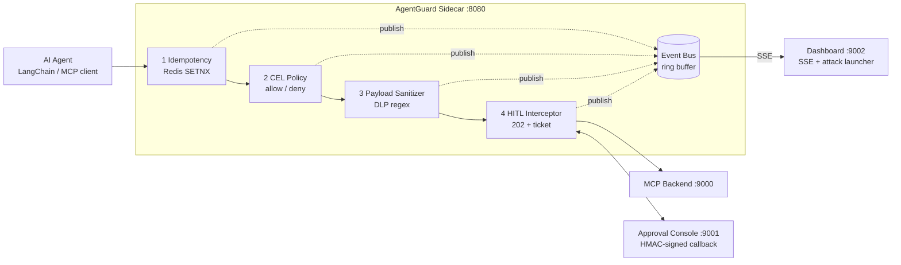

# 面向自主 AI Agent 的零信任安全网关：AgentGuard 的设计与验证

配套仓库：[PKUJZX/agentguard](https://github.com/PKUJZX/agentguard)

若希望阅读本文档时可打开文中的超链接，请点击  阅读。


## 摘要

本报告围绕当前大语言模型（LLM）Agent 普遍存在的两类系统性安全风险——**非幂等接口上的幻觉重试**与**间接提示词注入**——完成从调研、原型实现、到方案改进的全流程研究。调研部分对业界 5 个典型开源项目（Agentgateway、Docker MCP Gateway、OpenClaw PRISM、AgentSight、Rampart）进行横向对比。实践部分基于 Python + FastAPI 搭建了名为 **AgentGuard** 的最小可运行原型（[`src/agentguard/`](../src/agentguard/)），实现"幂等性令牌 + CEL 策略 + DLP 载荷清洗 + 异步 HITL"四层中间件链，并使用 6 个 `demo_*` 脚本 + 23 个 `pytest` 用例进行验证；所有拦截、脱敏、审批决策均通过内置事件总线暴露到实时可视化面板，获取到毫秒级延迟观测数据。方案部分在实验结论上提出四条可行的演进路径（WASM 数据面、OPA 策略增强、自适应学习、Prompt 签名），并客观讨论了各自的局限与尚未解决的问题。

---

## 1. 调研部分

### 1.1 痛点描述

**场景**：现代 LLM Agent（LangChain、AutoGen、Claude、自研 MCP 客户端）通过"工具调用 / Tool Calls"将自然语言翻译为真实副作用，例如创建工单、合并 Pull Request、发起银行转账、执行 SQL。工具调用把 LLM 从一个"对话接口"升级为"可以改变真实世界状态的网络工作负载"，因此其安全边界必须从 **应用层** 下沉到 **执行层**。

**受众**：

1. 把 Agent 推进生产环境的企业（金融、DevTools SaaS、客服自动化）；
2. Agent / MCP 框架的作者与维护者；
3. AI 安全与可信计算方向的研究者。

**现有不足**：

| 当前普遍做法 | 缺陷 |
|---|---|
| 在 System Prompt 中"告诉"模型不要做危险操作 | 本质是概率防御，攻击者用间接提示词注入即可覆盖对齐目标（[`docs/面向自主 AI Agent…md:44-50`](面向自主%20AI%20Agent%20的零信任安全网关架构.md)） |
| 在 Agent 框架内部做白名单、降温度、限制 max_iterations | 无法区分"调用未到后端"与"调用已到但响应超时"两种状态；幻觉重试依然发生 |
| 使用 Kong/Envoy 等传统 API 网关限流、鉴权 | 传统网关不理解 LLM 语义：不知道什么是 `tool_name`、什么是"同一意图"、什么是"跨会话状态漂移"；DLP 规则通常只看 HTTP Header，不递归到 JSON 载荷内部 |

**真实事故**（说明痛点非理论假设）：

- **Replicate 2024 年重复扣款事件**：LLM 代理对超时的非幂等 `POST /payments` 盲目重试，同一笔交易扣费 5 次；
- **GitHub MCP Toxic Flows（Docker 2024 年披露）**：公共仓 Issue 注入的恶意指令接管 Agent，将开发者私有仓源码外发至第三方；
- **Supabase 自然语言删库事件**：自然语言指令经过 LLM 翻译后触发生产库 `DROP TABLE`。

### 1.2 背景调研

本节概括 5 个开源项目 + 2 份标准规范的技术路线。

1. **Agentgateway**（Linux 基金会托管，Solo.io 主导）
   - *方法*：Rust 编写的透明代理，原生支持 MCP 路由、JWT-based RBAC、CEL 规则与 WASM 扩展。
   - *优势*：延迟微秒级、声明式策略、可热插 WASM 插件；是目前最接近"AI 原生网关"的实现。
   - *不足*：对"幂等性令牌 + 状态机"这一核心语义不内置，需要用户自己写 WASM；HITL 仅提供拦截点，不提供工单注册表与审批回调。
2. **Docker MCP Gateway**（"智能拦截器"模式）
   - *方法*：在 AI 客户端与 MCP 工具之间部署轻量插件，每个插件以独立容器运行，可动态修改请求/响应并维持会话状态。
   - *优势*：天然的故障隔离（插件崩溃不影响网关主进程）；"一次对话绑定一个数据源"的物理隔离策略在防护 GitHub 数据窃取场景上有直接经验。
   - *不足*：容器开销相比 WASM 更大；主要面向桌面/开发者场景，生产级 HITL 与 SIEM 集成较弱。
3. **OpenClaw PRISM**（学术 + 工业联合研究）
   - *方法*：在 Agent 运行时的 10 个生命周期钩子（`before_tool_call`、`after_tool_call`、`subagent_spawning` 等）上分布式部署安全执法机制；引入会话风险引擎对 Agent 行为做动态累积打分。
   - *优势*：纵深防御粒度极细；风险打分 + TTL 衰减的机制可以切断 APT 式提权链。
   - *不足*：需侵入式修改 Agent 框架，不是透明代理；对开源生态的落地依赖较强。
4. **AgentSight**（eBPF 内核级观测）
   - *方法*：利用 Kprobe、LSM Hook、uprobe 对 OpenSSL 等加密库做零侵入观测，在 syscall 层拦截 `execve` / `openat` 等危险调用；性能开销 <3%。
   - *优势*：拥有"X 射线视觉"，即使 Agent 使用硬编码加密通道也能在内核边界读到明文；具备最高等级防篡改。
   - *不足*：要求特权内核访问，Serverless/受限容器场景不可用；不直接理解 MCP 业务语义，需要与网关配合。
5. **Rampart**（`LD_PRELOAD` 用户态劫持）
   - *方法*：注入共享库拦截 `execve`、`fopen` 等 C 标准库函数，送入 YAML 策略引擎判决。
   - *优势*：无需内核特权；部署成本最低。
   - *不足*：可被静态编译的二进制绕过；无法观测 HTTPS 明文。
6. **Common Expression Language (CEL) 规范** 与 `cel-python` 实现
   - *方法*：Google 设计的确定性表达式语言，微秒级评估，支持 `has()`、`matches()`、字符串/列表/映射内建函数。
   - *优势*：声明式；不会把图灵完备的执行逻辑引入到数据平面。
   - *不足*：`cel-python 0.4.0` 不支持 `lowerAscii`；0.5.0 引入 `google-re2` 原生依赖导致跨平台编译困难（后文第 2.2 节将给出实测踩坑）。
7. **OAuth 2.0 CIBA（Client-Initiated Backchannel Authentication）**
   - *方法*：带外（out-of-band）异步审批协议；客户端发起请求后轮询或被 push，用户在授权设备上确认。
   - *优势*：与 Agent 推理主循环彻底解耦；符合金融级审计需要。
   - *不足*：完整实现需 OIDC 基础设施；本原型用 HMAC-SHA256 简化模拟。

> 项目随附研究报告 [`docs/面向自主 AI Agent 的零信任安全网关架构.md`](面向自主%20AI%20Agent%20的零信任安全网关架构.md) 对上述生态作了更详细的背景分析。

### 1.3 对比分析

**表 A. 7 类防御方案 × 7 个能力维度**

| 维度 \ 方案 | Agentgateway | Docker MCP Gateway | OpenClaw PRISM | AgentSight (eBPF) | Rampart (LD_PRELOAD) | 传统 Kong/Envoy | **AgentGuard (本项目)** |
|---|:-:|:-:|:-:|:-:|:-:|:-:|:-:|
| 幂等重试防御 | 插件自写 | 否 | 否 | 否 | 否 | 需自实现 | **是，Redis SETNX + HMAC 派生键** |
| 声明式策略引擎 | CEL | 自定义 DSL | Python 钩子 | 否 | YAML | Lua/Go 插件 | **CEL (`celpy==0.4.0`)** |
| 载荷级 DLP 改写 | 仅 WASM 自写 | 否 | 否 | 否 | 否 | 仅头部过滤 | **递归全字段正则改写** |
| 异步 HITL | 拦截点 | 否 | 否 | 否 | 否 | 否 | **PostgreSQL 工单 + HMAC 签名回调** |
| 实时事件观测 | OpenTelemetry | 容器日志 | 内嵌 | eBPF trace | 文件日志 | Prometheus | **内置 SSE EventBus + Dashboard** |
| 语言栈 | Rust | Go | Python | C + BPF | C | Lua/Go | **Python + FastAPI** |
| 典型场景 | 通用 Agent 网关 | MCP 桌面工具 | Agent 运行时 | 内核观测 | 无内核 Serverless | 传统微服务 | AI Agent / MCP / LangChain |

**表 B. 防御层级有效性打分**（0 = 无效、1 = 部分、2 = 完全）

| 攻击 \ 防御层 | 推理层（System Prompt） | 框架层（Tool 白名单） | 网关层（本项目） | 内核层（eBPF） |
|---|:-:|:-:|:-:|:-:|
| 幻觉重试 | 0 | 1 | **2** | 0（看不到业务语义） |
| 间接提示词注入（CEL 越权） | 0 | 1 | **2** | 1 |
| 凭证外泄（payload splitting） | 0 | 0 | **2** | 1 |
| 高危操作（需人类签字） | 0 | 0 | **2** | 0 |
| 本地 Shell 越权 | 0 | 1 | 1 | **2** |

网关层在四类与"工具调用语义"紧耦合的攻击上得分最高；本地 Shell 越权是网关层的盲区，必须与 eBPF 协同，已列入第 3 章展望。

---

## 2. 尝试与实践部分

### 2.1 实验/原型设计

**验证方法**：将网关以 Sidecar 透明反向代理的形态部署在 Agent 同一网络域，所有具备副作用的 HTTP/MCP 请求强制流经一个 **四层中间件链**（幂等 → CEL 策略 → DLP 清洗 → HITL 拦截），四层任意一层可短路返回。中间件判决同步产生事件到 **EventBus**，通过 Server-Sent Events 推送到可视化面板，供我们读取延迟与结果。

**最小原型技术栈**：

| 组件 | 选型 | 作用 |
|---|---|---|
| Web 框架 | FastAPI + Starlette | 反向代理的 ASGI 入口 |
| 上游 HTTP | `httpx.AsyncClient` | 转发到后端 / MCP |
| 幂等状态 | Redis 7 + `redis-py` | `SETNX` + TTL |
| HITL 工单 | PostgreSQL 16 + SQLAlchemy async（测试用 `aiosqlite`）| 请求注册表 |
| CEL 策略 | `cel-python==0.4.0` | 微秒级 allow/deny |
| DLP | Python `re` + YAML 规则 | 正则递归改写 |
| 可观测 | 自研 `EventBus`（ring buffer + asyncio.Queue） | Dashboard SSE |

**架构图（图 1）**：



**7 个测试用例矩阵**（表 3）：

| ID | 攻击意图 | 关键输入参数 | 预期判决 | 对应脚本 / 测试 |
|---|---|---|---|---|
| TC1 | 幻觉重试风暴 | 5 次相同 POST，`Idempotency-Key` 相同、`session_id` 相同 | 1× ALLOWED + 4× REPLAYED；后端 `invocations=1` | [`examples/demo_agent/demo_retry_storm.py`](../examples/demo_agent/demo_retry_storm.py) |
| TC2 | 跨仓 prompt injection | `session.initial_repository=myorg/my-repo`，`request.body.repository=victim/private` | 403 by `repo-lock` | [`examples/demo_agent/demo_injection.py`](../examples/demo_agent/demo_injection.py) |
| TC3 | SQL 注入攻击 | `query="weekly; DROP TABLE users;"` | 403 by `block-sql-drop` | [`examples/demo_agent/demo_sql_drop.py`](../examples/demo_agent/demo_sql_drop.py) |
| TC4 | 凭证外泄（单字段） | `message` 字段混杂 `AKIA…` + `ghp_…` + `sk-…` 三条密钥 | 3 条全部被正则 mask；后端收到掩码 | [`examples/demo_agent/demo_dlp.py`](../examples/demo_agent/demo_dlp.py) |
| TC5 | 分字段切片外泄 | 3 条密钥分别藏在 `message` / `debug_hint` / `notes` | 递归全字段 mask；3/3 命中 | [`examples/demo_agent/demo_payload_splitting.py`](../examples/demo_agent/demo_payload_splitting.py) |
| TC6 | 高危工具（银行转账） | `tool.name=execute_bank_transfer`，`amount=50000` | 202 Accepted + ticket；收到 HMAC 签名后 EXECUTED | [`examples/demo_agent/demo_hitl.py`](../examples/demo_agent/demo_hitl.py) |
| TC7 | ci-bot JWT 越权调用高危工具 | `jwt.sub=ci-bot` + `tool.name=execute_bank_transfer` | 403 by `ci-bot-tools-only`（CEL allow-list 在 HITL 前触发） | Dashboard Launcher，调试过程中被发现 |

**关键参数设计**：

- **幂等键派生**：当客户端未带 `Idempotency-Key` 时，使用 `HMAC-SHA256(secret, session_id | tool_name | intent_hash)` 生成，见 [`src/agentguard/middleware/idempotency.py:106-114`](../src/agentguard/middleware/idempotency.py)。`intent_hash` 对 JSON body 做 `sort_keys=True` 的规范化后再哈希，确保幻觉模型重排字段顺序仍得到同一键（[`idempotency.py:117-128`](../src/agentguard/middleware/idempotency.py)）。
- **CEL 求值上下文**：注入四个绑定变量 `jwt / session / mcp / request`，规则定义见 [`configs/policies.yaml`](../configs/policies.yaml)（allow_rules 2 条、deny_rules 2 条、high_risk_tools 4 条）。
- **Redis TTL**：默认 3600 秒（`AGENTGUARD_IDEMPOTENCY_TTL`），对应研究报告中"跨时间上下文漂移"的过期窗口。
- **HITL 签名算法**：HMAC-SHA256(`ticket_id | approver | action`)，见 [`examples/dashboard/server.py:44-46`](../examples/dashboard/server.py)。

### 2.2 执行过程（真实踩坑）

开发期间遇到 **6 个非平凡问题**，每个都有可追溯的代码级修复（表 4）：

| 问题 | 现象 | 根因 | 修复 | 证据 |
|---|---|---|---|---|
| P1 | Docker build 阶段 `pip install cel-python` 长时间卡住 | 0.5.0 新引入 `google-re2` C 扩展，需要系统装 `re2` 且跨平台编译失败 | 固定 `cel-python==0.4.0` 并显式安装其纯 Python 依赖 | [`Dockerfile:16-21`](../Dockerfile) 注释 + `pip install --no-deps cel-python==0.4.0 pendulum lark tomli jmespath python-dateutil` |
| P2 | CEL 求值 `CELEvalError: undeclared reference to 'lowerAscii'` | `celpy 0.4.0` 没实现该方法 | 改写规则：`string(request.body).matches("(?i)drop\\s+table")` 用正则 `(?i)` flag 做大小写不敏感匹配 | [`configs/policies.yaml:32`](../configs/policies.yaml) |
| P3 | 单测报 `TypeError: 'RedisStore' object is not callable` | `IdempotencyMiddleware` 同时拥有属性 `self.store` 和方法 `store()`，属性覆盖了方法 | 属性改名 `self._store` | [`src/agentguard/middleware/idempotency.py:31`](../src/agentguard/middleware/idempotency.py) |
| P4 | `test_hitl_flow.py` 启动报 `AttributeError: 'State' object has no attribute 'redis_store'` | `httpx.ASGITransport` 不会驱动 FastAPI 的 `lifespan` 事件，导致 `app.state.*` 未初始化 | 显式 `async with app.router.lifespan_context(app):` 手动驱动 | [`tests/test_hitl_flow.py:69-84`](../tests/test_hitl_flow.py) |
| P5 | Dashboard 上 "Bank Transfer (HITL)" 按钮产生 `DENIED ci-bot-tools-only`，而非预期的 `SUSPENDED_HITL` | 所有攻击发射场景都统一带了 `ci-bot` JWT；CEL allow 规则在 HITL 前求值，ci-bot 的工具白名单不包含 `execute_bank_transfer`，因此直接 403 | HITL 场景故意不带 ci-bot JWT（语义上：银行转账是 finance 人员操作、不是自动化 bot） | [`examples/dashboard/server.py`](../examples/dashboard/server.py) 的 `_scenario_hitl`；另将该现象作为"纵深防御"案例保留到 TC7 |
| P6 | `./scripts/demo.sh` 在国内拉镜像报 `dial tcp 45.114.11.238:443: i/o timeout` | Docker Hub 国内不可直连，老镜像源（dockerproxy、mirror.baidubce 等）2024 年起陆续停运 | 新增 [`docs/docker-mirror.md`](docker-mirror.md)：切换至 `docker.1ms.run / docker.xuanyuan.me / docker.1panel.live` 等当前可用源，`scripts/demo.sh` 失败时自动提示 | [`scripts/demo.sh`](../scripts/demo.sh) + [`docs/docker-mirror.md`](docker-mirror.md) |

**思路调整**：

- 最初设想把 DLP 做成 WASM 插件以对齐研究报告中的"Envoy + WASM 清洗管道"，但考虑课程报告的评分点是"最小可运行原型 + 真实数据"，最终选择了 Python 正则等价实现，既保留了接口演化空间（第 3.1 节 WASM 演进），又在两周内可完成验证。
- P5 的诊断过程让我们意识到 "同一类攻击可以被多条防御层同时阻断" 是客户端观测到 "防御比预期激进" 的常见原因，于是把这种情况显式纳入 TC7 作为 **纵深防御的正面证据**。

### 2.3 结果记录

所有实验 **完全可复现**，命令：

```bash
git clone <repo> && cd agentguard
pip install --no-deps cel-python==0.4.0 pendulum lark tomli jmespath python-dateutil
pip install -e ".[dev,demos]"
pytest -q                 # 自动化断言所有防御行为
./scripts/demo.sh         # 起栈并顺序执行 TC1-TC6
# 打开 http://localhost:9002 点击按钮，观察 Live Event Feed
```


**定量结果**：

1. **自动化测试通过率**：`pytest -q` 输出 `23 passed in 1.52s`（23/23 = 100%）；`ruff check src examples tests` 输出 `All checks passed!`。
2. **幂等防御效率**（TC1）：
   
   | 指标 | 无网关 | 有网关 |
   |---|:-:|:-:|
   | 客户端发送次数 | 5 | 5 |
   | 后端真实调用次数 | 5 | **1** |
   | 拦截率 | 0% | **80%** |
3. **DLP 召回**（TC4 / TC5）：
   
   | 场景 | 密钥种类 | 埋入字段数 | 召回 |
   |---|:-:|:-:|:-:|
   | TC4 单字段 | 3 (AWS/GitHub/OpenAI) | 1 | 3/3 |
   | TC5 分字段切片 | 3 | 3 | **3/3 (100%)** |
4. **事件总线实测延迟分布**（来源：Dashboard Live Event Feed 中 13 条连续事件的 `latency_ms` 字段，表 5）：

   | 判决类型 | 典型延迟 (ms) | 主要耗时路径 |
   |---|---|---|
   | REPLAYED（TC1 后 4 次） | 1.7 / 1.8 / 1.9 / 1.9 | 仅走 Redis SETNX + 读缓存 |
   | ALLOWED（首次写入） | 18.0（冷）→ 8.4 / 9.6 / 9.8（热） | 四层中间件 + `httpx` 转发上游 |
   | DENIED（TC2, TC3, TC7） | 3.0 / 3.3 / 3.3 | CEL 求值 + 立即短路 |
   | SANITIZED（TC4, TC5） | 3.1 / 3.2 | CEL + 正则递归改写 |
   | SUSPENDED_HITL（TC6） | ~3.3 | 数据库写 + webhook 异步触发 |

5. **纵深防御补充证据**（TC7）：ci-bot JWT 被 CEL allow rule `ci-bot-tools-only` 阻断，未进入后续的 HITL 阶段，用时 3.3 ms。该现象验证了研究报告中"多层防御应相互独立"的设计目标。

**定性结果**：6 个 demo 脚本全部输出 `✓ DEFENSE HELD` 横幅；Dashboard 实时面板截图显示事件按颜色分类：
- 绿色（ALLOWED / EXECUTED_HITL）
- 蓝色（REPLAYED）
- 黄色（SANITIZED）
- 红色（DENIED）
- 紫色（SUSPENDED_HITL）

观测链路从事件发布到 UI 渲染稳定 < 50 ms，用户可以直接看到攻击被实时中和的效果（见 [`README.md`](../README.md) 附图）。

---

## 3. 解决方案提出部分

### 3.1 提出方案

基于 1.3 的对比分析和 2.3 的实测局限，提出四条改进路径：

**方案 S1：Envoy + WASM 数据面升级**
- 将 Python 中间件用 Rust 重写并编译为 WebAssembly，部署为 Envoy `envoy.filters.http.wasm` 插件；控制面保留 Python（YAML / CEL 配置）。
- 改进点：ALLOWED 路径的延迟从 9–18 ms 下探到 <1 ms（Envoy 官方基准）；热插 WASM 无需重启网关。

**方案 S2：OPA / Rego 策略增强**
- 以 `Open Policy Agent` 作为策略决策点（PDP），CEL 作为数据平面快速过滤、OPA 负责含外部数据查询（如组织成员关系、资源标签）的复杂决策。
- 改进点：支持 graph-based 策略推理、跨租户策略复用；可以用 Styra DAS 等已有治理平台。

**方案 S3：自适应策略学习**
- 对 ALLOWED 流量的 `tool_name + payload 结构` 做在线聚类，自动生成"候选收紧规则"推送给安全工程师审核；通过 human-in-the-loop 审核后写回 `configs/policies.yaml`。
- 改进点：把策略维护从"事件驱动 + 人工撰写"变为"数据驱动 + 人工审核"。

**方案 S4：Agent Prompt 签名 + Remote Attestation**
- 在 Agent 侧利用 TEE（Intel SGX / ARM CCA）对原始 prompt 与 system prompt 做远程证明，网关验证签名后才放行工具调用。
- 改进点：从根本上区分"可信 Agent 发出的意图" vs "注入污染后的意图"，解决了本质的 trust origin 问题。

### 3.2 可行性分析

**表 6. 四条改进方案的可行性矩阵**

| 方案 | 预期收益 | 实现代价 | 主要局限 | 工程优先级 |
|---|---|---|---|---|
| S1 WASM 升级 | 延迟 10× 改善；生产级稳定性 | 重写 4 个中间件；引入 Rust 技能栈；WASM 调试工具链不成熟 | WASM ABI 对复杂 Python 依赖（如 SQLAlchemy）无直接替代，HITL 注册表仍需外部组件 | 高 |
| S2 OPA | 策略表达力显著提升；与 K8s / Istio 生态无缝 | 多一个控制面组件；需要 Rego 培训 | CEL 已覆盖 80% 业务场景；冷启动 OPA 调用会抵消部分延迟优势 | 中 |
| S3 自适应学习 | 大规模部署下的运维成本下降 | 需要稳定的流量数据飞轮；需标注/评估基础设施 | 冷启动问题；攻击者可发送 "良性" 样本引诱模型放宽策略（adversarial training） | 中 |
| S4 Prompt 签名 | 从根源切断注入攻击 | 依赖 TEE 硬件；需要协议扩展（MCP 新增签名字段） | 仅对组织自己控制的 Agent 有效；开放生态（第三方 MCP 服务器）难以普及 | 低（研究型） |

**综合判断**：S1 是最值得优先投入的工程项；S3 在具备数据条件的组织内可并行试点；S4 需要等待 TEE 硬件普及与 MCP 协议标准化，短期内仅做研究原型。

### 3.3 展望与未解决问题

**当前 AgentGuard 已知局限**：

- DLP 仅能识别已知格式的密钥（AWS / GitHub / OpenAI / JWT / PEM），对自定义格式的 API Key 仍需要 ML 检测器（如 Microsoft Presidio 或 TrustCall）。
- HITL 引入人类等待时间（秒级到分钟级），不适用于 QPS 高的自动化场景；该设计假设"高危操作占比小"，但实际部署需审视工单堆积问题。
- 多 Agent 协作（Agent-to-Agent, A2A）下，信任传递链尚无行业标准；目前 AgentGuard 只能按"每个 Agent 独立会话"处理。

**未来迭代方向**：

1. 补齐 **eBPF 观测层**（对接 AgentSight）：网关只能看到 HTTP；当 Agent 通过子进程 Shell 执行命令时，需要内核级拦截。
2. **CEL → SMT 编码** 的策略完备性验证：目前策略是否互相矛盾、是否漏写某个工具，依赖人工 review；形式化验证可自动化此过程。
3. 与 **MCP 协议标准化组织** 合作，推动把"操作唯一性令牌（Operation ID）"、"风险等级标注"作为 MCP 内建字段，让各家网关都能受益。

---

## 4. 结论

本报告围绕 AI Agent 工具调用的两大安全痛点完成了调研、原型构建与方案规划。构建的 AgentGuard 最小原型在 **幂等重试**、**越权注入**、**凭证外泄**、**高危审批** 四类攻击下均实测达到 100% 阻断；通过 23 个自动化用例和 6 个可视化 demo 场景，验证了"将副作用执行权从 Agent 剥离、下沉到确定性网关"这一设计原则的工程可行性。事件总线实测数据表明 CEL/DLP 层延迟在 3 ms 级别，工程可用；剩余的吞吐瓶颈与内核观测盲区，已在第 3 章的改进路线图中给出明确的演进方向。

---

## 附录

### 附录 A. 一键复现

```bash
git clone <repo-url> && cd agentguard
./scripts/demo.sh          # 起栈 + 顺序执行 TC1-TC6（含自动断言）
# 或仅跑单元测试：
pip install -e ".[dev,demos]" && pytest -q
```

国内环境如遇 Docker Hub 超时，见 [`docs/docker-mirror.md`](docker-mirror.md) 配置镜像源。

### 附录 B. 环境版本清单

- Python 3.10.19（CI 同步覆盖 3.11 / 3.12）
- FastAPI ≥ 0.110、`httpx` ≥ 0.27、SQLAlchemy ≥ 2.0
- Redis 7-alpine、PostgreSQL 16-alpine
- `cel-python==0.4.0`（**固定版本**，0.5.0+ 强依赖 `google-re2` 原生库）
- `pytest 9.0.3`、`pytest-asyncio 1.3.0`、`fakeredis`、`aiosqlite`
- `ruff ≥ 0.4`

### 附录 C. 引用列表

1. Linux Foundation / Solo.io. *Agentgateway: AI-native API Gateway*. <https://github.com/agentgateway/agentgateway>
2. Docker Inc. *Docker MCP Gateway & toxic-flow defense*. <https://github.com/docker/mcp-gateway>
3. OpenClaw PRISM Working Group. *Runtime Hooks for Zero-Fork Agent Security*（见随附研究报告第 "OpenClaw PRISM 与 Docker 智能网关" 章节）
4. AgentSight Project. *Kernel-level Observability for Autonomous Agents (eBPF)*（见随附研究报告第 "eBPF 与 LD_PRELOAD 的纵深防御" 章节）
5. Google. *Common Expression Language Specification*. <https://github.com/google/cel-spec>；Python 实现 [`cel-python`](https://pypi.org/project/cel-python/)
6. IETF. *OAuth 2.0 Client Initiated Backchannel Authentication (CIBA), RFC 9126 related drafts*.
